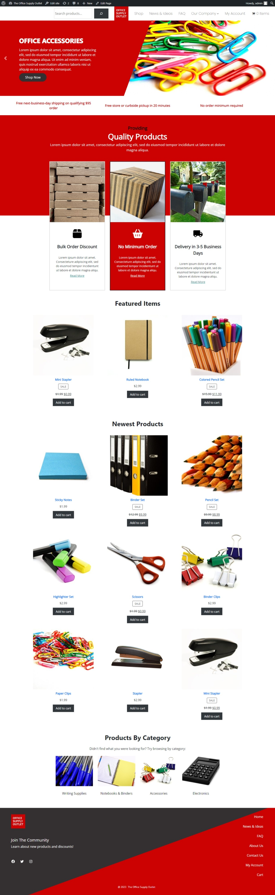
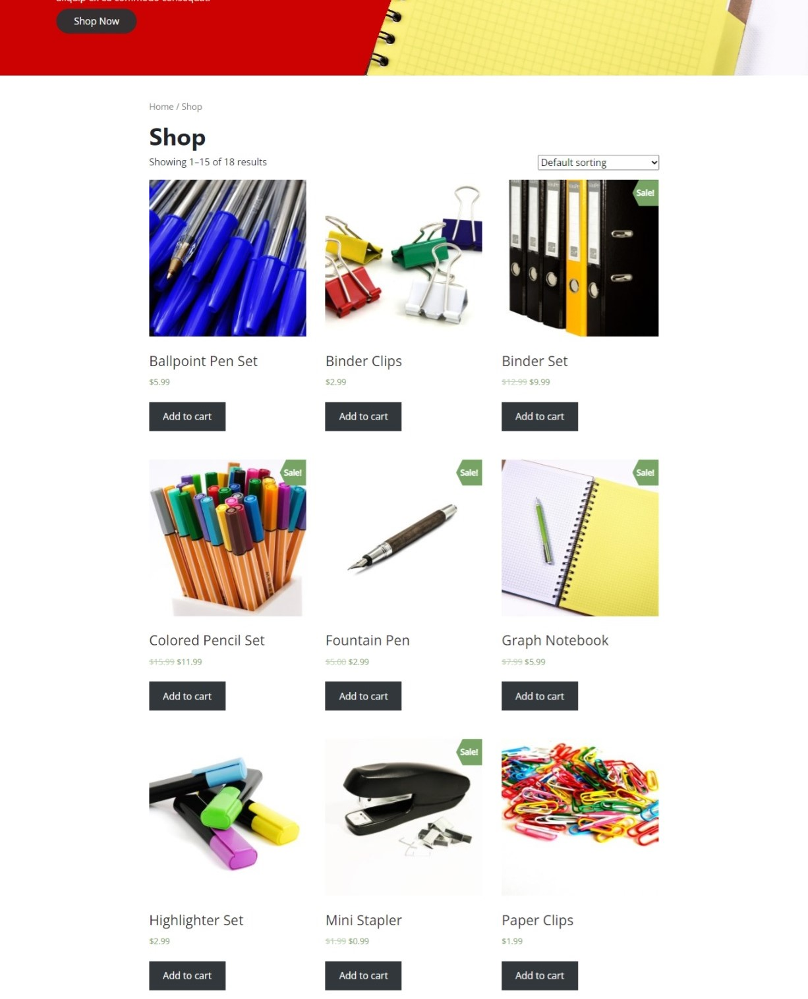
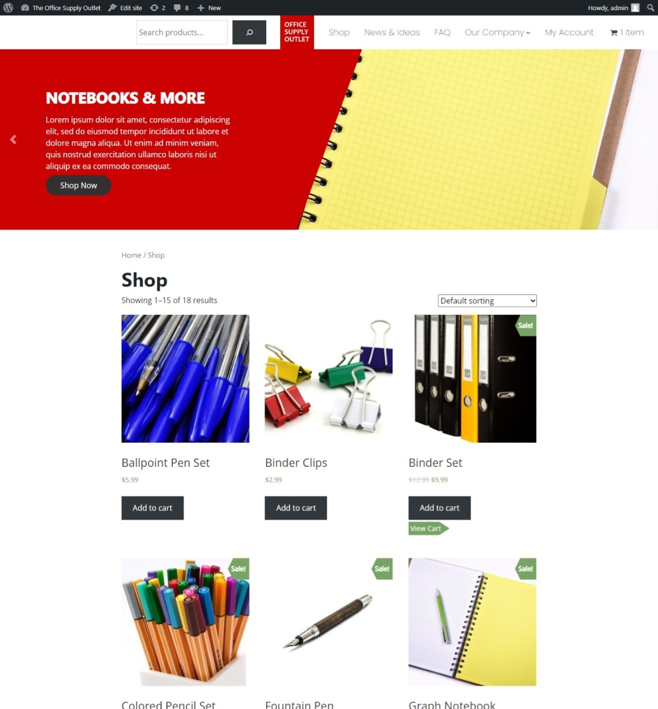
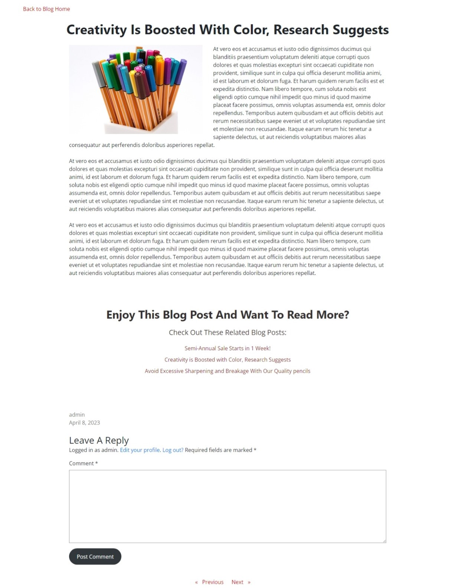
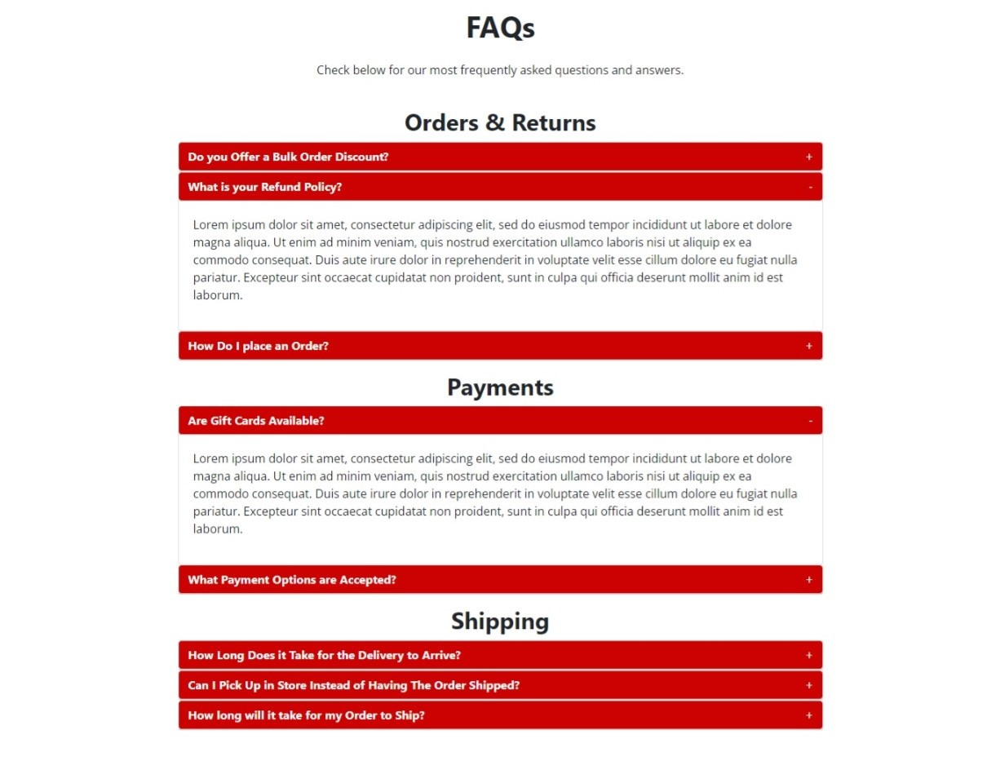
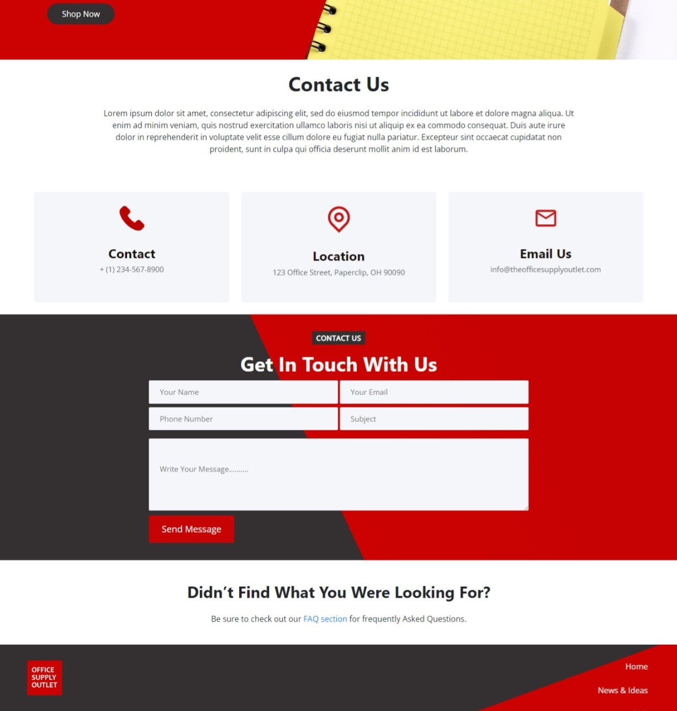
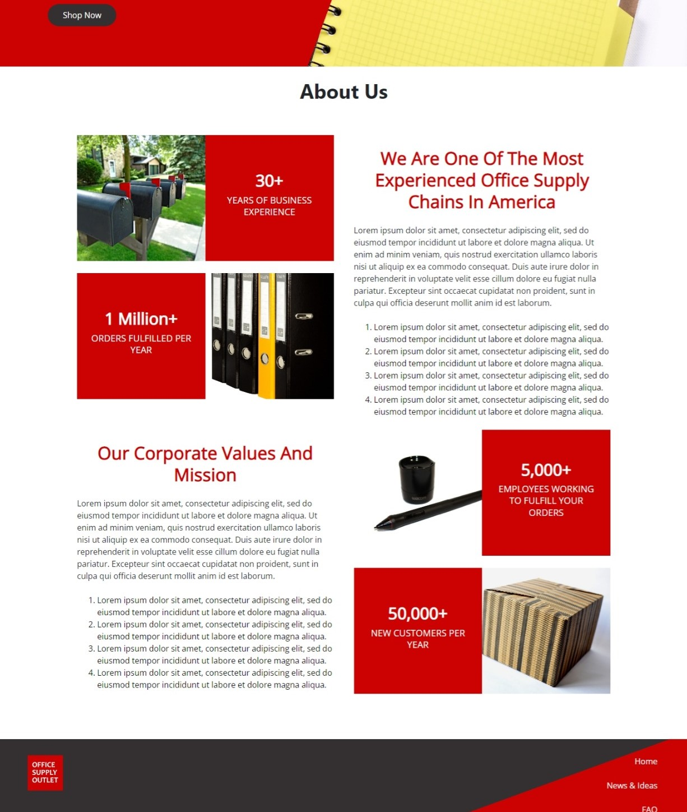

# The Office Supply Outlet Website

A WordPress custom block theme website for an office supply company. Built with HTML, CSS, PHP, JavaScript, Bootstrap, and more. There are two custom post types, one to add/update FAQ data to the FAQ accordions and another to add/update the heading sliders, which are in a Bootstrap carousel. The project utilizes the WooCommerce plugin for the shop functionality, the Advanced Custom Fields plugin for additional fields in the header-slides custom post type, and several patterns from wordpress.org. 

## Suggested Blog Posts Plugin

The code for the theme itself can be found in this repository. If you would like to see the code for the Suggested Blog Posts Block Plugin, please visit:
[https://github.com/MichelleAaa/wp-suggested-blog-posts-plugin](https://github.com/MichelleAaa/wp-suggested-blog-posts-plugin)

## Project Screen Shots

Landing Page

The landing page begins with a navbar which was built in the full site editor. It contains a WooCommerce products search bar that dissapears at a specified viewport size. Next is the heading slider, which pulls data from the heading-slides custom post type. The Advanced Custom Fields plugin has been used to add additional fields to this custom post type for the button text and link. The slide layout is modified from a wordpress.org pattern. Farther down the page is a pattern from wordpress.org which displays three highlights. Following the pattern is a selection of filters from WooCommerce to highlight specific product types. Near the bottom of the page is a list of the top 4 product categories with links. The footer also was built and is editable in the full site editor.

Shop Page

The shop page pulls the shop details from the WooCommerce plugin.

Add to Cart with WP Menu Cart Plugin

With the WP Menu Cart Plugin each time a user Clicks the 'Add to Cart' button on a product the total in the navbar for the cart is incremented by 1. In addition, a 'View Cart" button appears under the product that was added. The plugin can be set to enable the cart icon to dissapear from the navbar when on the cart page.

Single Blog Post Page & Custom Suggested Blog Posts Plugin

The News & Ideas blog page shows the featured image on the left and the post information on the right. There is also a custom WP_Query() that will ensure that only blog posts, with post type of 'post', will show in the Blog Post search.

News & Ideas Blog Page

 that will ensure that only blog posts, with post type of 'post', will show in the Blog Post search.")

The News & Ideas blog page shows the featured image on the left and the post information on the right. There is also a custom WP_Query() that will ensure that only blog posts, with post type of 'post', will show in the Blog Post search.

FAQs Page

A custom post type called faq allows the user to enter the title, content, and category types for FAQs. Custom code then creates accordions based on the category types. Each post renders as a dropdown in the applicable accordion.

Contact Us Page

The Contact Us page features a modified pattern from wordpress.org. This includes hoverable contact details and a contact form. Due to time constriants the form data doesn't currently get saved or sent anywhere, however, a Thank You page will display upon clicking 'Send Message'.

About Us Page

The About Us page features a modified pattern from wordpress.org.

Cart Page

The Cart page renders from the WooCommerce plugin and has been modified to match the site theme in regards to hover effects. 

## Reflection

I built this project while studying WordPress custom block themes and some of the popular WordPress plugins, such as WooCommerce and Advanced Custom Fields. The goal was to make a website that allows more codeless edits than a classic theme typically allows. Many of the components of the website are editable in the Full Site Editor, while others have custom post types that allow the content to easily be modified.

## References

- Udemy - Brad Schiff - Become a WordPress Developer: Unlocking Power With Code - https://www.udemy.com/course/become-a-wordpress-developer-php-javascript/ (For the placeholder class used to convert PHP blocks into a placeholder block which is visible on the front-end, but not editable in the block editor.)
- Button hover effect adapted from: https: //codepen.io/giana/pen/xdXpJB
- wordpress.org Patterns - Designer: Hiral Rupapara - 404 Page - https://wordpress.org/patterns/pattern/404-page-16/ 
- wordpress.org Patterns - Designer: Hiral Rupapara - Effective Solutions - https://wordpress.org/patterns/pattern/effective-solutions/
- wordpress.org Patterns - Designer: devangi09 - Contact Us Details With Form - https://wordpress.org/patterns/pattern/effective-solutions/
- wordpress.org Patterns - Designer: FinestWebGeek.com - About Section Design with Background Image - https://wordpress.org/patterns/pattern/about-section-design-with-background-image/
- wordpress.org Patterns - Designer: FinestWebGeek.com - Experience Area, Service Area, Image and Text, Media and Text - https://wordpress.org/patterns/pattern/about-section-design-with-background-image/

Stock Photos:
-  https://pixabay.com/photos/cardboard-box-box-gift-cardboard-389934/
- https://pixabay.com/photos/mailbox-letterbox-flag-post-mail-2462122/
- https://pixabay.com/photos/boxes-cardboard-pizza-boxes-pizza-5429964/
- https://pixabay.com/photos/not-found-404-error-file-not-found-2384304/
- https://pixabay.com/photos/post-it-sticky-note-tab-paper-20370/
- https://pixabay.com/photos/binder-folder-binders-office-order-428299/
- https://pixabay.com/photos/stapler-desk-supplies-office-1758617/
- https://pixabay.com/photos/kraft-notebook-with-elastic-band-2542530/
- https://pixabay.com/photos/school-pen-top-pointed-write-93200/
- https://pixabay.com/photos/ballpoint-pen-writing-implement-1743869/
- https://pixabay.com/photos/calculator-computer-solar-calculator-168360/
- https://pixabay.com/photos/scissors-sharp-tool-metal-cutting-3074340/
- https://pixabay.com/photos/binder-blue-clips-clip-green-2085/
- https://pixabay.com/photos/paper-clips-background-business-20383/
- https://pixabay.com/photos/stapler-metal-desktop-staples-5521592/
- https://pixabay.com/illustrations/tape-dispenser-tape-adhesive-6845981/
- https://pixabay.com/photos/notebook-pencils-notes-write-1803664/
- https://pixabay.com/photos/accessories-accessory-art-business-4847727/
- https://pixabay.com/photos/wacom-accessories-graphic-design-1859814/
- https://pixabay.com/photos/notebook-pen-pencil-education-1207543/
- https://pixabay.com/photos/colored-pencils-felt-tip-pens-402546/
- https://pixabay.com/photos/fountain-pen-pen-stylograph-ink-789893/
